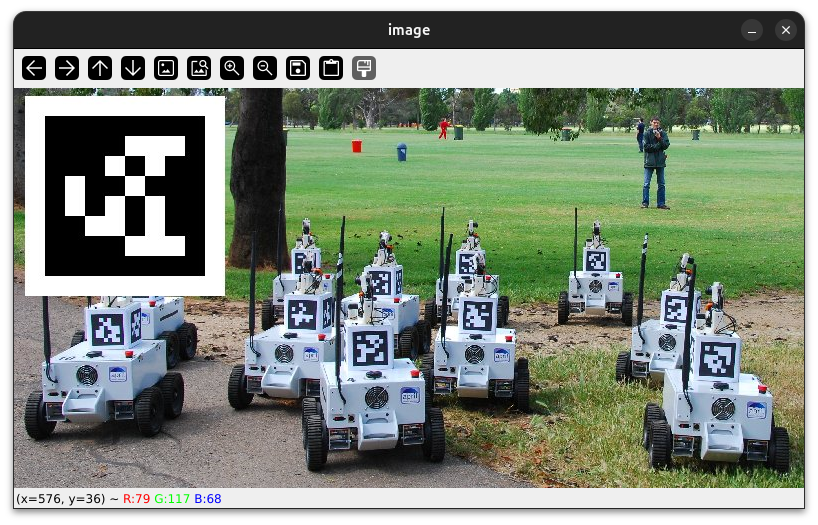
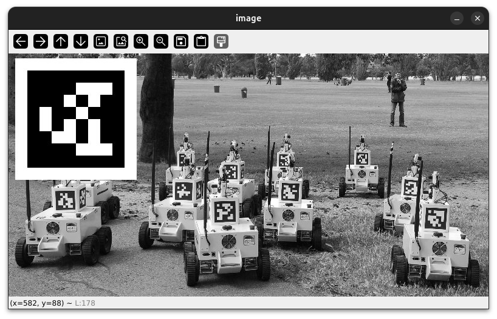
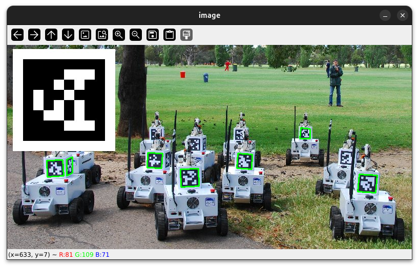

# Detecting apriltags with OpenCV and Python

!!! warning "This guide isn't finished yet!"

    It has all the setup instructions, but aside from that has nothing written yet.

This guide will show you how to use [[Python]] and [[OpenCV]] to detect [[Apriltag|Apriltags]].

## Image sources

You can detect apriltags in any type of image, or use a camera. For this guide I'll use an image from the University of Michigan that includes several apriltags of the 36H11 family.


## Instructions

1. Setup environment & install OpenCV

    This step will be different depending on what operating system you are on, but all systems generally follow this pattern:

    1. Ensure Python is installed
    2. Install a text editor or [[IDE]]
    3. Install opencv and the apriltag library

    === "Linux"

        Linux is the easiest operating system to use for this guide, so if you already have it installed that is perfect.

        Python should be installed by default on most Linux distributions. You can ensure it is installed by typing `python3` into your terminal. If it fails and you are using debian/ubuntu-based distros, you can use this command to install Python: `sudo apt install python3`. If you are using some other distribution of Linux then you should see if there is a `python` or `python3` package available to be installed.

        If you don't know how to use vim, [[VSCodium]] is a good second choice for an editor. You can install it via snap with this command: `snap install codium --classic`, or by manually installing the `.deb` (or `.rpm`, `.AppImage`, etc.) from [the GitHub releases page](https://github.com/VSCodium/vscodium/releases).

        The apriltag project requires cmake to be installed. You can install it by running `sudo apt install cmake` on Ubuntu/Debian-based distributions.

        The last thing you will need is to install OpenCV and the apriltag library. You can do this by running `pip3 install opencv-python apriltag` in your terminal.

    === "Windows"

        Download python from <https://www.python.org/downloads/windows/>, and then install it. 

        If you are on a team laptop, [[VSCode]] should be installed already and you shouldn't need to install an IDE. If this is not the case, then you should install WPILib to get the full suite of FRC software (including WPILib VSCode). 

        To install the cv2 and apriltag packages on Windows, you can refer to [this guide](https://packaging.python.org/en/latest/tutorials/installing-packages/) which explains how to explain python packages. The package names are `opencv-python` and `apriltag`.

    === "Mac OS"

        You can download Python from here: <https://www.python.org/downloads/macos/>.

        For an IDE, [[VSCode]] is an option. Otherwise, you can download the latest `.dmg` release of VSCodium: <https://github.com/VSCodium/vscodium/releases>.

        To install the packages on Mac, just run `pip3 install opencv-python apriltag`.

    === "Chromebook"

        You will likely have a hard time trying to follow along this guide using a chromebook, especially if it is a school-issued one. The development environment is very slow and takes a long time to run your code. If possible, switch to a different device.

        A [Jupyter Lite Notebook](https://jupyter.org/try-jupyter/lab/) might work in the future. Try creating a new notebook with Pyodide and then running this script to install everything you need:

        ```python title="JupyterLite Setup Script" hl_lines="4"
        import micropip

        await micropip.install("opencv-python")
        await micropip.install("apriltag") # This does not work
        ```

        As of the writing of this guide, the [apriltag package](https://pypi.org/project/apriltag/) cannot be installed within Pyodide.

2. Setup project structure

    After installing everything that is required, create a new folder. I suggest somewhere in the `Documents` folder, but it is up to you. Create a file in your new project folder called `main.py`. This is where all of our [[Python]] code will go.

    If you are going to use the image from the University of Michigan, you should also download it to the same folder and call it `image.jpg`.

3. Setup the IDE

    Open the new `main.py` file in your text editor or IDE. Put this text in there:

    ```python title="main.py"
    print("hello world")
    ```

    Now, try to run it.

    === "VSCode / VSCodium"

        On VSCode or VSCodium you can open a terminal window by pressing ++ctrl+j++. Then, type `python3 main.py` to run your program.
    
    === "Vim"

        In Vim, you can type `<CMD>terminal<CR>` (this is the same as ++colon+t+e+r+m+i+n+a+l+enter++) to open a terminal window. 

        It will probably not go where you want it to, so you can type `<C-w>r` to flip the windows. (This means ++ctrl+w++, then ++r++)
    
    When you run the program, it should print out "hello world" to the console.

    !!! tip "Don't retype everything every time"

        If you are using the terminal to run your script, you can use the up arrow ( ++up++ ) to skip all the typing after you've run your program once.

4. Add imports

    You have already installed [[OpenCV]] and the `apriltag` package, but now we need to use them. Delete everything in your `main.py` file and replace it with this:

    ```python title="main.py"
    import cv2
    import apriltag
    ```

    This tells Python that we want to use everything in the `cv2` ([[OpenCV]]) and `apriltag` packages.

5. Get a video or photo input

    In order to detect apriltags, you will need some kind of photo or video to detect them in.

    === "Image"

        ```python title="main.py" hl_lines="4-5"
        import cv2
        import apriltag

        # Read image file
        image = cv2.imread("image.jpg")
        ```

    === "Webcam"

        Instead, if you want to detect apriltags from the webcam, you can do this:

        ```python title="main.py" hl_lines="4-8"
        import cv2
        import apriltag

        # Setup a video capture object
        cam = cv2.VideoCapture(0)

        # Read a single image from it
        _, image = cam.read()
        ```

6. Display the image

    You might notice that running your script doesn't appear to do anything yet. This is because we haven't done anything with the image. Let's display it in a new window using [[OpenCV]]:

    ```python title="main.py" hl_lines="3-5"
    # ...

    # Display the image
    cv2.imshow("image", image)
    cv2.waitKey()
    ```

    If you run the script now, you should see a window with the image.

    

7. Convert the image to grayscale

    There are at least three channels in the image you just displayed. One for the red contents of the image, one for the blue and one for the green. However, for detecting the apriltag it is much easier to only have a single channel. It is easier for the `apriltag` package to detect the apriltags if there is no color, so we will convert the image to a grayscale one using OpenCV.

    ```python title="main.py" hl_lines="3"
    # ...

    gray = cv2.cvtColor(image, cv2.COLOR_BGR2GRAY)

    # Display the image
    cv2.imshow("image", gray)
    cv2.waitKey()
    ```

    !!! tip
    
        Don't forget to also change the image being displayed by `cv2.imshow`, otherwise you will still see the image with color

    

8. Detect apriltags

    The next step is to make use of the `apriltag` package and detect the apriltags.

    We first need an `apriltag.Detector` object to detect the apriltags. It has a few options that you can configure, but for now we will just set the family to 36h11 as that is what my image contains.

    ```python title="main.py" hl_lines="5-7"
    # ...

    gray = cv2.cvtColor(image, cv2.COLOR_BGR2GRAY)

    detector = apriltag.Detector(
        apriltag.DetectorOptions(families="tag36h11")
    )

    # Display the image
    cv2.imshow("image", gray)
    cv2.waitKey()
    ```

    After creating the `detector`, we need to tell it to detect apriltags in our image. Here is how to do that:

    ```python title="main.py" hl_lines="8-9"
    # ...
    gray = cv2.cvtColor(image, cv2.COLOR_BGR2GRAY)

    detector = apriltag.Detector(
        apriltag.DetectorOptions(families="tag36h11")
    )

    results = detector.detect(gray)
    print(results)

    # ...
    ```

    Now if you run the script, you should see something like this appear in the console:

    ```
    [Detection(tag_family=b'tag36h11', tag_id=3, hamming=0, goodness=0.0, decision_margin=83.49791717529297, homography=array([[-1.46298201e+00, -2.33748738e+00,  4.19032887e+01],
       [ 2.74977265e-01, -5.13138146e-01,  1.24367093e+01],
       [-2.47093499e-03, -2.80314209e-03,  7.19309551e-02]]), center=array([582.54875941, 172.89787484]), corners=array([[591.97900391, 164.17155457],
       [591.97235107, 183.00921631],
       [571.6262207 , 183.00509644],
       [573.03771973, 162.69270325]])), ...]
    ```

    This isn't very human readable, but it does give you a lot of information about the apriltags in the image. You can see that it is an array (contained in square brackets) of `Detection`s, which each have a `tag_family`, `tag_id`, `hamming`, `goodness` and `decision_margin` fields. All of these fields are useful. `tag_id` is the ID of the apriltag, and `corners` contains an array of points that mark the corners of the apriltag.

9. Draw some boxes

    Technically, you are now finished. You have detected apriltags in an image using [[OpenCV]]. But this kind of result isn't very presentable and also seems pretty boring. Lets draw some boxes around the apriltags to make it look nicer.

    ```python title="main.py" hl_lines="3-18 20"
    # ...

    for result in results:
        (corner_a, corner_b, corner_c, corner_d) = result.corners

        corner_a = (int(corner_a[0]), int(corner_a[1]))
        corner_b = (int(corner_b[0]), int(corner_b[1]))
        corner_c = (int(corner_c[0]), int(corner_c[1]))
        corner_d = (int(corner_d[0]), int(corner_d[1]))

        line_color = (0, 255, 0) # green
        line_thickness = 2

        # Draw a rectangle using the corners
        cv2.line(image, corner_a, corner_b, line_color, line_thickness)
        cv2.line(image, corner_b, corner_c, line_color, line_thickness)
        cv2.line(image, corner_c, corner_d, line_color, line_thickness)
        cv2.line(image, corner_d, corner_a, line_color, line_thickness)

    cv2.imshow("image", image)
    cv2.waitKey()
    ```

    This uses the `corners` field found in the last step to draw some boxes around the apriltags. Notice that the lines are drawn on the original image (`image`), instead of the grayscale version (`gray`). This allows us to keep the color of the original image alongside the fancy boxes. Remember to change the `cv2.imshow` parameter back to `image` though, otherwise you won't get to see the boxes.

    

10. Try other things

    Now that you can detect the apriltags, you can do many other things with that information. Here is a list of things you can try, but don't be afraid to do something else entirely:

    - Instead of using a single frame from the webcam, try to make it detect apriltags in real time.
    - Do [[Pose Estimation]] to figure out where the camera is relative to the apriltag
    - Draw more annotations on the original image, such as the tag ID or a circle instead of a box.