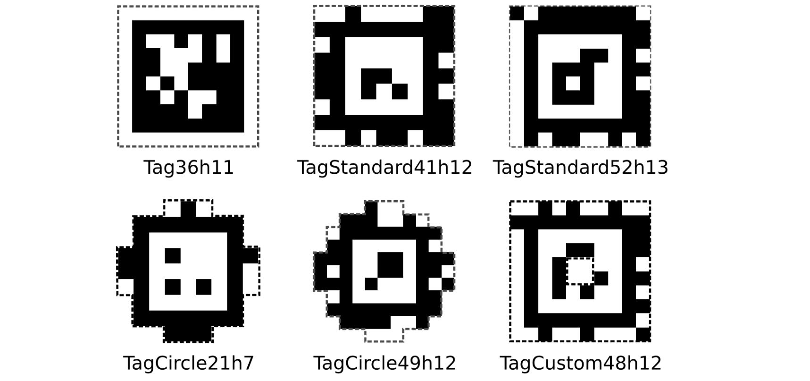

# Apriltag

!!! warning "This page is not finished!"

    If you are a team member and know more about this topic than what is currently here please contribute that information.

Apriltags are square qr-code-like images that encode a very small amount of information. They are sometimes placed in [[FRC]] fields, and can be used for [[Pose Estimation|pose-estimation]] to figure out where the robot is relative to the tags.

## Families

There are different kinds of 'families' of apriltags. Here is a chart from the FIRST docs that shows a few of the most common families:

The `36h11` family was used in 2024 and 2025, and is the family most likely to be used in future years.

## Uses

- [[Pose estimation]]

## Links

- <https://docs.limelightvision.io/docs/docs-limelight/pipeline-apriltag/apriltags>
- For [[FTC]], <https://ftc-docs.firstinspires.org/en/latest/apriltag/vision_portal/apriltag_intro/apriltag-intro.html>
- <https://community.firstinspires.org/2025-apriltag-information> (2025 apriltag info)
- Apriltag Images and User Guide: <https://firstfrc.blob.core.windows.net/frc2024/FieldAssets/Apriltag_Images_and_User_Guide.pdf>