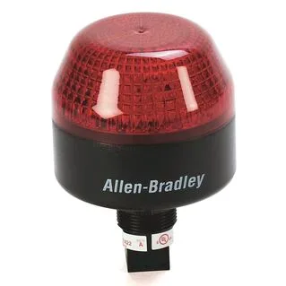

# Blinky Light

!!! warning "This page is not finished!"

    If you are a team member and know more about this topic than what is currently here please contribute that information.

(Also knows as the "Robot Signal Light" or just "RSL")

> The Robot Signal Light (RSL) is required to be either Allen-Bradley 855PB-B12ME522 or AndyMark am-3583. It is directly controlled by the roboRIO and will flash when enabled and stay solid while disabled.
> \- <https://docs.wpilib.org/en/stable/docs/controls-overviews/control-system-hardware.html#robot-signal-light>

