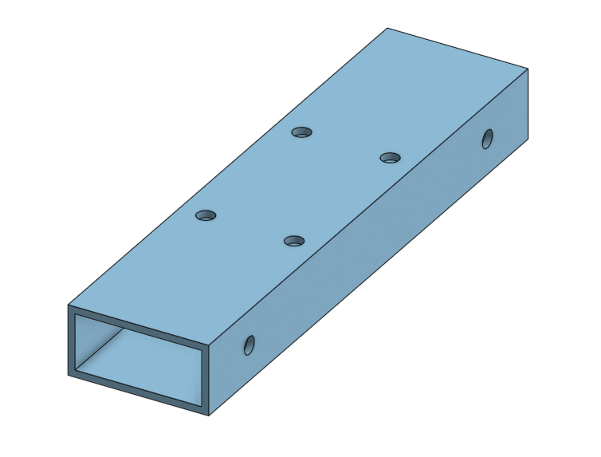
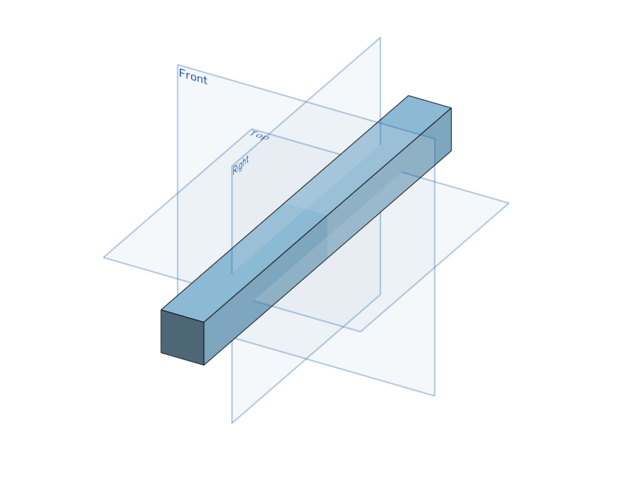
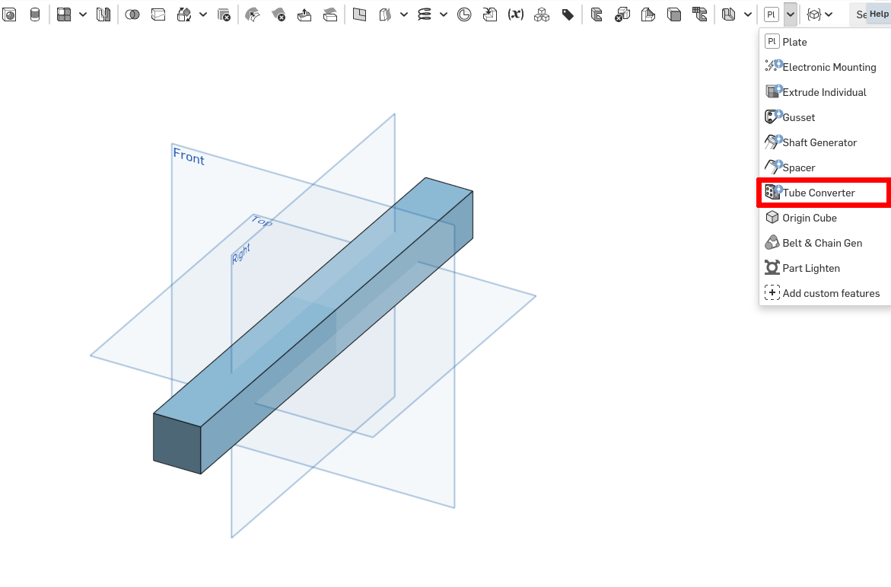
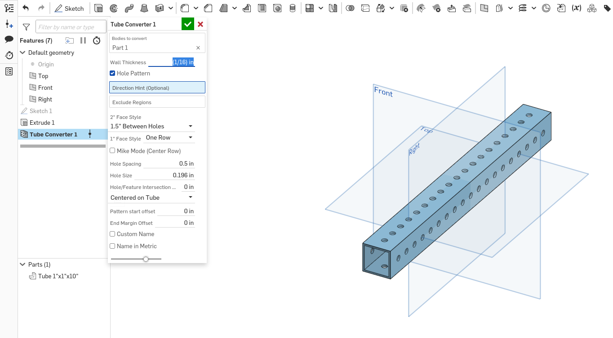

# Box Tube

!!! warning "This page is not finished!"

    If you are a team member and know more about this topic than what is currently here please contribute that information.

It is a box, and it is a tube.

## Featurescript

There is a featurescript for creating box tube. It is called "Tube Converter".

1. Create a box
    
    This example will use a 1x1 box that is 10 inches long.

    

2. Use the featurescript

    

3. Configure the new feature

    Change 'Bodies to convert' to your box, and change the other options until it looks right and matches your specification. 

    Some options that you should definitely verify are:

    - Wall Thickness
    - Hole pattern configuration

    

4. Done!

    Now you can add [[Gusset|gussets]] if needed.