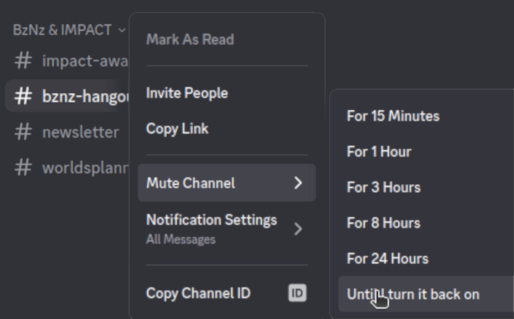

# Discord

!!! warning "This page is not finished!"

    If you are a team member and know more about this topic than what is currently here please contribute that information.

Discord is an online messaging app that our team uses to communicate.

Our team uses a Discord server as our primary method of communication. It's important for all members to be in it because communication is important. Be sure to check it daily! (Better yet, set up push notifications on your phone!)

## Setting up Discord

When you finish the steps to join, you should see our "square root of -1" logo on the left side of the screen.

### Join using the web version

1. Go to <https://discord.com> and sign in or create an account.
2. Ask a team member or mentor for a link or code to join the server.

### Join using the desktop version

1. Open Discord on your computer and sign in or create an account.
2. Click the + button on the left side of the screen. At the bottom of the popup that appears, click "Join a server."
3. Ask a team member or mentor for a code to join the server.

## Muting Channels

You can mute channels that you do not want to receive notifications from by right clicking on the channel and then selecting "Mute Channel" and selecting how long you want the channel to be muted for. The same can be done for entire servers.

