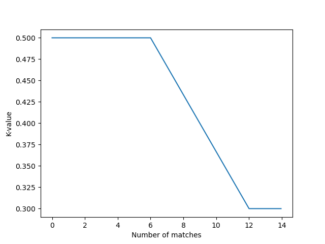

# EPA

EPA (Expected points added) is a statistic developed by [[Statbotics]] used to predict how many points a robot is expected to add to a given alliance. It is used eveywhere in our scouting subteam for a baseline of how a team will perform if we haven't seen any of their matches.

You will almost certainly never need to calculate it by hand or implement it with code. Statbotics has an API that allows easy access to this information.

## K-parameter

The K-parameter is a variable used to control how much a team's EPA changes for a given match. Larger values of $K$ will result in bigger EPA changes for every match.

According to the statbotics blog post, it is calculated like this:

$$
K = \begin{cases} 
          0.5                     & N \leq 6 \\
          0.5 - \frac{1}{30}(N-6) & 6 \lt N \leq 12 \\
          0.3                     & N \gt 12 
       \end{cases}
$$

Where $N$ is the number of matches that the team has played.

As you can see, after 6 matches $K$ will decrease linearly until it is equal to $0.3$.

## EPA Changes

EPA Changes are something you will likely never need to calculate manually, but it can be interesting to see how the changes are calculated.

This is the formula for EPA changes:

$$
\Delta EPA = K \times \frac{1}{1+M} \times ((\text{Red Score} - \text{Red EPA}) - M \times (\text{Blue Score} - \text{Blue EPA}))
$$

Where $K$ is the [K parameter](#k-parameter), and M is the margin parameter.

$M$ can be calculated like this:

$$
M = \begin{cases}
        0                             & N \le 12 \\
        \frac{1}{24} \times (N - 12)  & 12 \lt N \le 36 \\
        1                             & N \gt 36
    \end{cases}
$$

(Where $N$ is still the number of matches the team has played)

### Component EPAs

> Since 2016, FRC games have been played with three phases: autonomous, teleoperated, and endgame. [[OPR]] can be separated into auto, teleop, and endgame components, and so naturally, we seek to do the same for [[EPA]]. 
> \- <https://www.statbotics.io/blog/epa#component-epa>

Here are the formulas used to calculate changes to component EPAs:

$$
\Delta \text{Auto EPA} = K \times (\text{Auto Score} - \text{Auto EPA})

\\

\Delta \text{Endgame EPA} = K \times (\text{Endgame Score} - \text{Endgame EPA})
$$

TeleOP EPA is not calculated in this way because it has more alliance interaction, so it is calculated like this:

$$
\text{TeleOP EPA} = \text{EPA} - \text{Auto EPA} - \text{Endgame EPA}
$$

## Match predictions

It is possible to predict the outcome of matches purely based on the EPA of each team. 

### Simple method

The simplest method for predicting matches it to lookup the EPA of each team on both alliances and then add them together. The alliance with a greater combined EPA is more likely to win.

## Further reading & Sources

- <https://www.statbotics.io/blog/epa>
- <https://github.com/avgupta456/statbotics/tree/master/backend/src/data/epa>