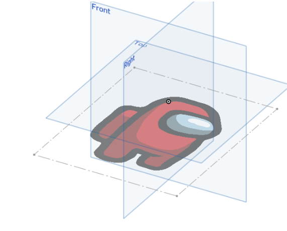

# FeatureScript

!!! warning "This page is not finished!"

    If you are a team member and know more about this topic than what is currently here please contribute that information.

> FeatureScript is a [] programming language designed by Onshape for building and working with 3D parametric models. The language is built into Onshape from the ground up, providing the foundation of Part Studio modeling, including robust geometric references, powerful parametric tools, and a type system with types built for math in three dimensions.  
> \- https://cad.onshape.com/FsDoc/

## Example

This is an example featurescript that inserts a new sketch reference of an Amongus character.

```featurescript
FeatureScript 2656;
import(path : "onshape/std/common.fs", version : "2656.0");

import(path : "212d85f6b078d782c08c8743", version : "00c6b06bc73a7cb4d1600b0c");


annotation { "Feature Type Name" : "Amongus", "Feature Type Description" : "Creates an amongus" }
export const myFeature = defineFeature(function(context is Context, id is Id, definition is map)
    precondition
    {
        annotation { "Name" : "Targets", "Filter" : EntityType.VERTEX }
        definition.targets is Query;
    }
    {
        // Define the function's action
        var amongusSketch = newSketch(context, id + "sketch1", {
                "sketchPlane" : qCreatedBy(makeId("Top"), EntityType.FACE)
            });


        skImage(amongusSketch, "amongus", {
                    "blobInfo" : BLOB_DATA,
                    "firstCorner" : vector(0, 0) * inch,
                    "secondCorner" : vector(1, 1) * inch
                });


        var vertices = evaluateQuery(context, definition.targets);


        // Iterate over each vertex and place the image
        for (var i = 0; i < size(vertices); i += 1)
        {
            var vertex = vertices[i];
            var vertexPosition = evVertexPoint(context, {
                    "vertex" : vertex
                });


            // Create the image at the vertex position
            skImage(amongusSketch, join(["amongus-", toString(vertexPosition[0]), "-", toString(vertexPosition[1])]).replace(" ", ""), {
                        "blobInfo" : BLOB_DATA,
                        "firstCorner" : vector(vertexPosition[0], vertexPosition[1]), // - vector(0.5 * inch, 0.5 * inch, 0), // Adjust to center the image
                        "secondCorner" : vector(vertexPosition[0] + 0.5 * inch, vertexPosition[1] + 0.5 * inch) // + vector(0.5 * inch, 0.5 * inch, 0) // Adjust to center the image
                    });
        }


        // Create sketch entities here
        skSolve(amongusSketch);


    });
```




## Sources

- <https://cad.onshape.com/FsDoc/>
- <https://www.onshape.com/en/blog/standardization-automation-complex-design-cad-featurescript>