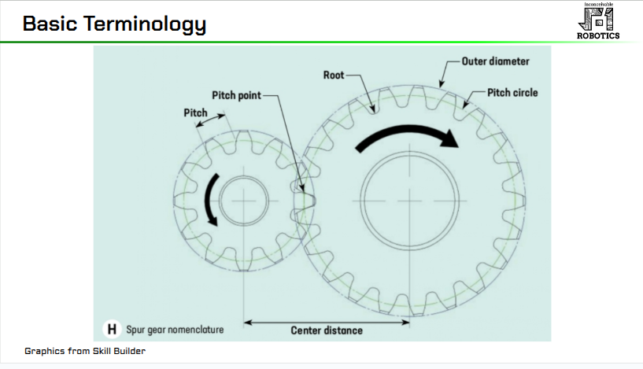
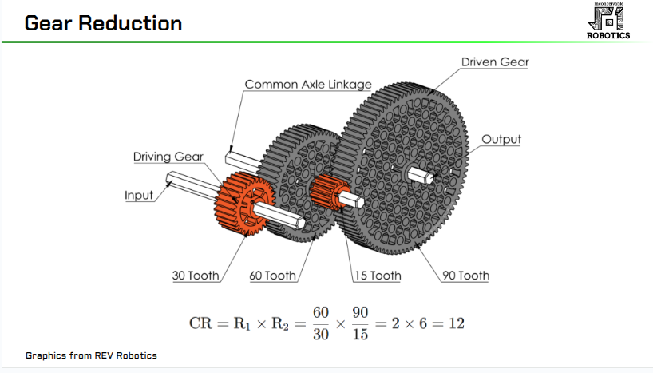
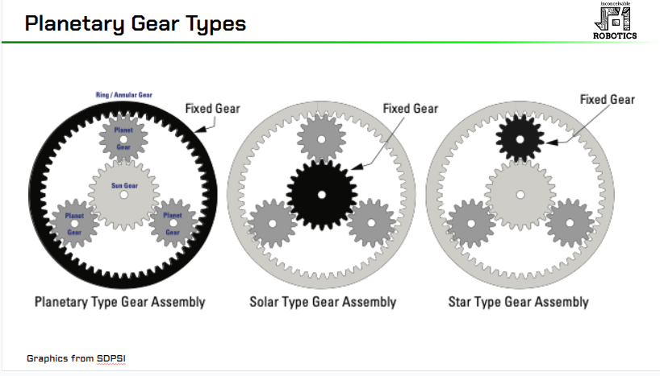

# Gears

!!! warning "This page is not finished!"

    If you are a team member and know more about this topic than what is currently here please contribute that information.

> "Gears are mechanical devices with teeth that mesh with each other to transmit motion or power between rotating shafts. They're like wheels with teeth that fit together, allowing them to transfer torque, change speed, and change direction of rotation."  
> \- <https://frcdesign.org/learning-course/stage1/1B/gears/#gear-basics>

## Basic Terminology

## Speed vs Torque

## Gear Reduction

## Types of Gears

## Team 2530 Usage of Gears

## Meshing

## Gear Usage Types

## Further Reading

- <https://frcdesign.org/learning-course/stage1/1B/gears/>
- [2025 Mechanical Presentation's "Quick Gear Education"](https://docs.google.com/presentation/d/1C_r5xqxeEzHAhgJAQVSqnHLc4F5nsQDgeuaSL3cUvX0/edit?usp=sharing)
- <https://www.tec-science.com/category/mechanical-power-transmission/gear-types/>
- <https://docs.revrobotics.com/ion-build/motion/gears>