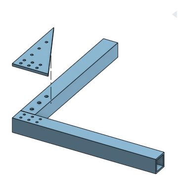

# Gusset

A gusset is a reinforcement thingy to strengthen the connections between two tubes.

## Example

This is an example of a gusset. The assembly has been exploded so that you can see all of the parts.

## Featurescript

There is a [[Featurescript]] for generating gussets.

!!! todo "Figure out the Gusset featurescript"