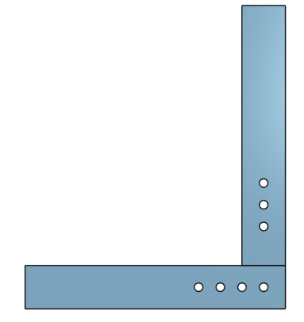
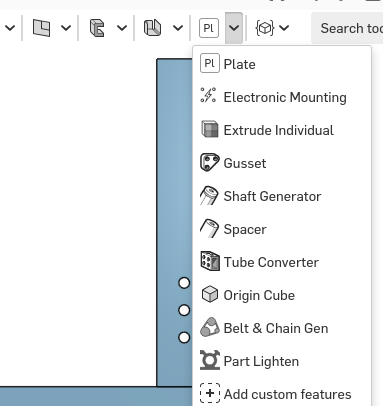
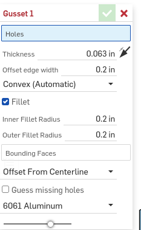
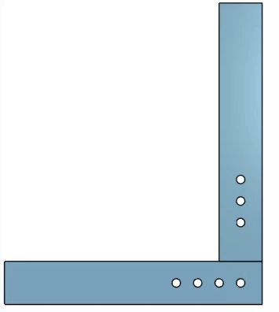
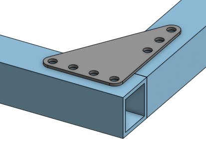

# Gusset

A gusset is a reinforcement thingy to strengthen the connections between two tubes.

## Featurescript

There is a [[Featurescript]] for generating gussets, contained in the "Julia's Featurescripts" collection. You can install it from the [official link](https://cad.onshape.com/documents/95c00401c440b44ad8799ef5/w/1f1ebce01a3b8eb6fa102975/e/b92d638809ae48771ecc7ad8) or use [this tutorial](https://frcdesign.org/learning-course/stage0/0B/featurescripts/) which explains the installation process.

### How to use the featurescript

1. Start with two box tubes that already have hole features in them.

    

2. Open the featurescript menu and select the Gusset featurescript

    

3. Mess with the settings until they are good

    You may need to invert the 'thickness' option if the gusset is inside of the tubes.

    

4. Select the holes used by the gusset

    

5. Keep working

    You will probably want to add screws next.

    