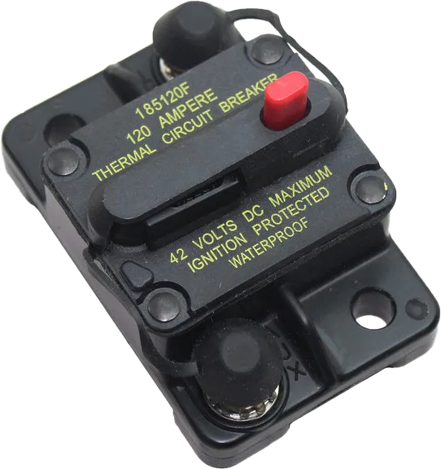

# Main Breaker

!!! warning "This page is not finished!"

    If you are a team member and know more about this topic than what is currently here please contribute that information.

The main breaker is the main on/off switch on the robot.

> The 120A Main Circuit Breaker serves two roles on the robot: the main robot power switch and a protection device for downstream robot wiring and components. The 120A circuit breaker is wired to the positive terminals of the robot battery and Power Distribution boards. For more information, please see the Cooper Bussmann 18X Series Datasheet (PN: 185120F)
> \- <https://docs.wpilib.org/en/stable/docs/controls-overviews/control-system-hardware.html>