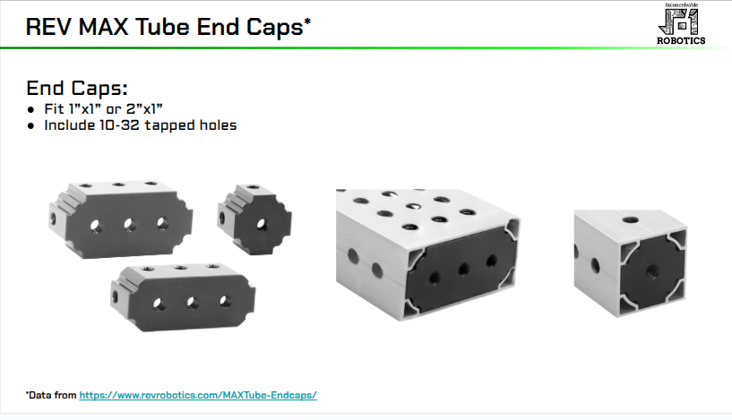

# MAXTube

!!! warning "This page is not finished!"

    If you are a team member and know more about this topic than what is currently here please contribute that information.

MAXTube is a variety of [[Box Tube]] produced by [[REV Robotics]].

## Presentation Images

## Further Reading

- <https://docs.google.com/presentation/d/1ZW1fv6NyXHSP0HrX1sn5W_wuCkH361i0uwxFCtxXFTk/edit?usp=sharing>

## Links

- <https://www.revrobotics.com/ion/structure/maxtube/>
- [2530 REV Channel Presentation](https://docs.google.com/presentation/d/1ZW1fv6NyXHSP0HrX1sn5W_wuCkH361i0uwxFCtxXFTk/edit?usp=sharing)
