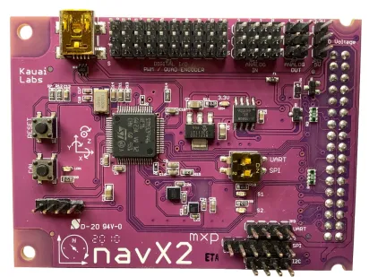

# NavX

!!! warning "This page is not finished!"

    If you are a team member and know more about this topic than what is currently here please contribute that information.

The NavX is an FRC component made by Kauai Labs. It is a "9-axis inertial/magnetic sensor and motion processor".

## Sources

- <https://pdocs.kauailabs.com/navx-mxp/>