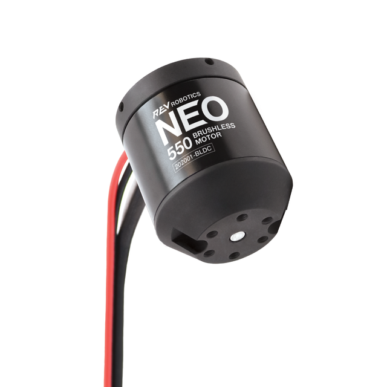
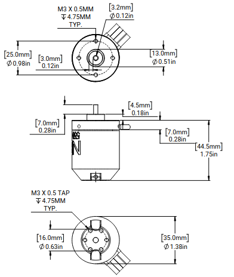

# Neo 550

> The NEO 550 Brushless Motor is a member in the NEO family of brushless motors. Its output power and small size are specifically designed to make NEO 550 the perfect motor for intakes and other non-drivetrain robot mechanisms. Mounting holes and pilot match a standard 550 series motor, making it natively mount to many existing off-the-shelf gearboxes.  
> \- <https://www.revrobotics.com/rev-21-1651/>

## Drawing

This screen capture was taken from [REV's official drawing](https://www.revrobotics.com/content/docs/REV-21-1651-DR.pdf).

## Specifications

Taken from the REV website, then converted into a table.

| Key                            | Value                                        |
| ------------------------------ | -------------------------------------------- |
| Nominal Voltage                | 12 V                                         |
| Motor Kv                       | 917 Kv                                       |
| Free Speed                     | 11000 RPM                                    |
| Free Running Current           | 1.4 A                                        |
| Stall Current                  | 100 A                                        |
| Stall Torque                   | 0.97 Nm                                      |
| Peak Output Power              | 279 W                                        |
| Motor Wire Gauge               | 16 AWG                                       |
| Hall-Sensor Encoder Resolution | 42 counts per rev.                           |
| Mounting Holes                 | M3 x 0.5 - max screw engagement 0.20in (5mm) |
| Output Shaft Diameter          | 0.125in (3.175mm)                            |
| Output Shaft Length            | 0.267in (7mm)                                |
| Output Pilot                   | 0.512in (13mm)                               |
| Body Length                    | 1.752in (44.5mm)                             |
| Body Diameter                  | 1.378in (35mm)                               |
| Motor Phase Wires Length       | 150mm (5.91in)                               |
| Motor Phase Wires Diameter     | 14AWG                                        |
| Sensor Cable Length            | 300mm (11.81in)                              |
| Sensor Cable Diameter          | 24AWG                                        |
| Weight                         | 0.142kg (0.313lbs)                           |

## Sources and Further Reading

- <https://www.revrobotics.com/rev-21-1651/>
- <https://docs.revrobotics.com/brushless/neo/550>
- <https://www.revrobotics.com/content/docs/REV-21-1651-DR.pdf> (Drawing)