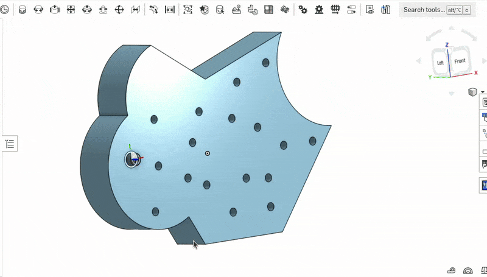

# Replicate

!!! warning "This page is not finished!"

    If you are a team member and know more about this topic than what is currently here please contribute that information.

An [[Onshape]] tool that lets you replicate mates in an assembly.

## Example

