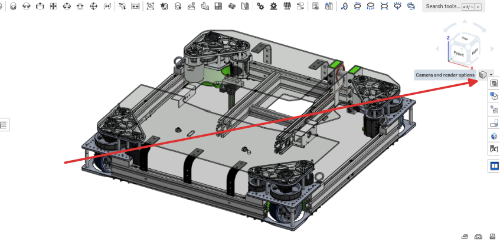

# Section View

Section view is an [[Onshape]] tool that allows you to temporarily cut parts to be able to see their insides.

## Using Section View

1. Click on the "Camera and Render options cube" in the top right of the screen.

    

2. Click on "Section View"

    

3. Select a face of the current studio
4. Drag the arrow