# The Shrieking Eel

The Shrieking Eel was our robot for the 2024-25 season [[Reefscape]].

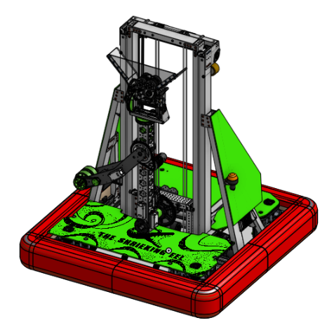

## Design

### Frame and Drivetrain

The Eel is a [[Swerve Drive]] robot. We use Mk4i modules with an L2 gearing in order to accelerate quickly for short cycle times. The drive motors are [[Kraken x60]]s, and the steering motors are [[NEO 1.1]]s. We 3D-printed wheel well guards to protect the drive train from dirt and debris. The wheels are [Black Neoprene Billet wheels](https://www.swervedrivespecialties.com/products/billet-wheel-4d-x-1-5w-bearing-bore) from [[Swerve Drive Specialties]], with an outside diameter (OD) of 4" and a width of 1.5". We use [[CANCoder]]s to measure the absolute rotation of the wheels.

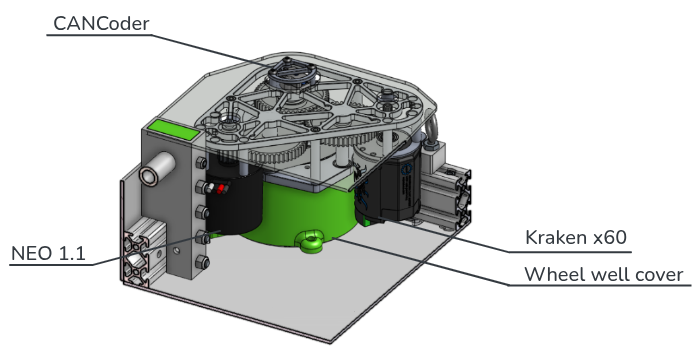

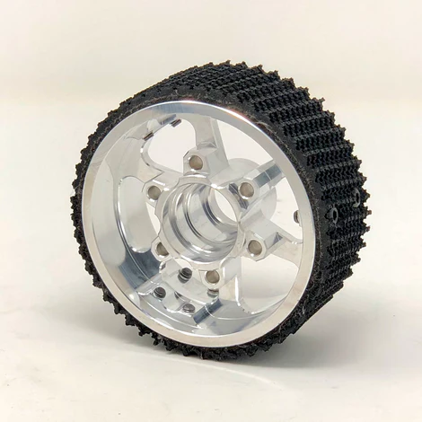

The frame perimeter is 29.5"x29.5". The baseplate is made of 3mm polycarbonate instead of HDPE for weight reasons, inspectability and frame rigidity. It is dropped by 0.75" with a aluminum blocks between the swerve module plate and the frame. Lowering the baseplate prevents bumps on the field and also reduces the risk of high-centering[^1] on algae gamepieces. The rails on the frame are made of [[8020|80/20]] #1020, with aluminum blocks to lower the [[Center of Gravity|CG]]. [[Eye Bolt|Eye bolts]] were added in the drop blocks to add carrying straps.

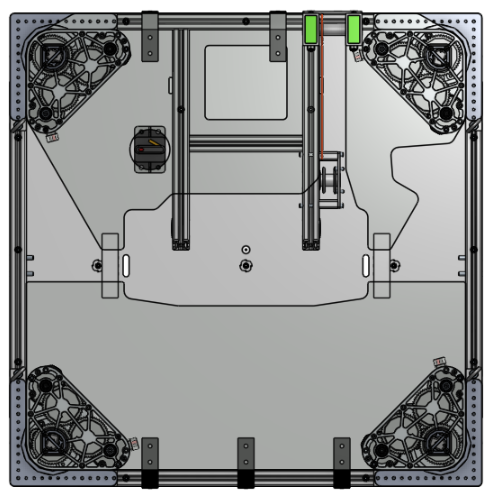

[^1]: [High-centering](https://en.wiktionary.org/wiki/high-center) means to "become stranded with all wheels off the ground" according to Wiktionary.

### Bumpers

This year's game manual introduced changes to bumper requirements, and we went through a lengthy design process to make them more sophisticated than ever.

Each set of bumpers (4 pieces in total, 2 red and 2 blue) takes the form of two U-shaped halves that form a rectangle.

!!! warning "Not finished"

    This section is a work in progress. An exploded view would be very nice, and it has been said that the backer components might not be made out of oak plywood anymore due to weight reduction.

Backer components are made of oak plywood, and have a height of 5in and a thickness of 0.7 inches.

The foam has two layers instead of three for shock reduction and simplicity. The inner layer is made of 2” Polyethylene (PE) Foam 1.7#/cuft from Foam Factory, <Foambymail.com>. The outer layer is made of 1" EVA Floor tiles (self measured density 4.3#/cuft:  Prosource Extra Thick EVA Foam Interlocking Tiles (Amazon)).

The red/blue cloth covers on the bumpers are made of Seattle Fabrics' 1000D Cordura Nylon. The numbers "2530" were printed as vinyl stickers. Comic sans was chosen as a font after a short survey.

These components were used for the brackets and mounts:  

- Corner Brackets: 2" Aluminum L channel 2" bracket
- Plummer Industries Vertical Mounts for frame attachment
- Through bolt X 2 through the 80/20 frame on each long side of U bumper for stabilization

### Elevator

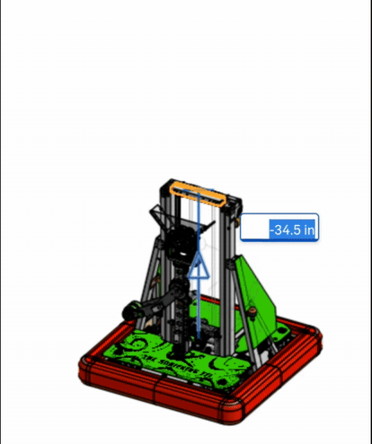

Our robot has a 2-stage cascade elevator with an arm/wrist mechanism on the top. The elevator is made of 1/16” thick 2x1 box tubes. It uses a [Billet Elevator Bearing Block](https://www.swervedrivespecialties.com/products/billet-elevator-bearing-block) by [[Swerve Drive Specialties|SDS]] for the bearing, and the rigging is #25 roller chain for the first stage and [[Dyneema rope]] from [[Thriftybot]] for the second. The elevator is driven by Kraken motors, and there are constant force springs that cancel some of the weight to allow it to accelerate quickly.

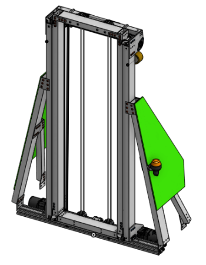

### Arm

The arm is attached by a joint to the second stage of the elevator. A [[NEO Vortex]] controls that joint, with a [[MAXPlanetary Gearbox]] and some other gears with an overall reduction of 96:1.

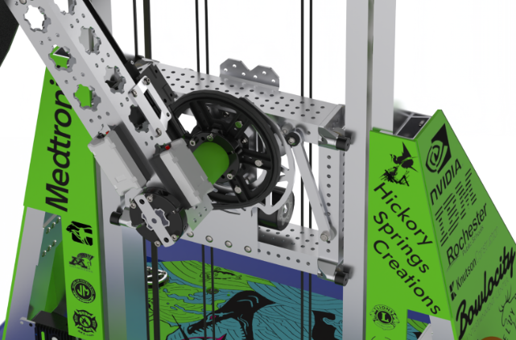

The arm itself is made of 2x2 [[MAXTube]] from [[REV]].

### Wrist

At the end of the arm, there is a wrist with 2 [[Degrees of Freedom|DOF]] (pitch and roll). It is powered by two [[Neo 550]]s. One of the motors is located further back on the arm and controls the roll of the wrist, and the other is on the wrist and controls the pitch.

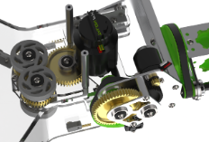

### Coral Manipulator

The coral manipulator is mounted to the end of the wrist. It is shaped like a dust pan and uses two sets of compliant wheels powered by a [[Falcon 500]]. The wheels grip the inside of a coral gamepiece against the dustpan to intake it, and can be reversed to release the coral over the reef.

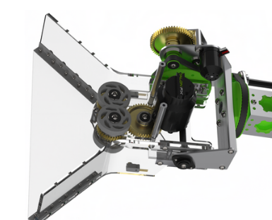

### Climber

The Shrieking Eel has a two-bar climber design. It uses the bars to rotate the cage and then latches around the cage. One bar is powered by a [[NEO Vortex]], and the other is not controlled.

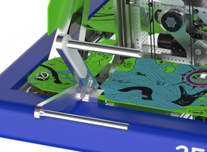

### Algae Manipulator

The Eel has an algae manipulator attached to the elevator. It is made out of two plates of [[MAXComposite]], and folds out on a rotation sprocket. There are two compliant wheels that roll algae in/out of the manipulator. It is powered by two [[NEO 550]]s, one of which is used to control the algae manipulator arm and the other spins the wheels.

The algae manipulator can intake from the reef and the lollipops (ice cream cones? The algae game pieces stacked on coral at the start of the game). It can score algae in the processor and in the barge.

<iframe width="560" height="315" src="https://www.youtube-nocookie.com/embed/OwTRkRwbCP8?si=2z-5-mifz_vIfkhl&amp;start=24" title="YouTube video player" frameborder="0" allow="accelerometer; autoplay; clipboard-write; encrypted-media; gyroscope; picture-in-picture; web-share" referrerpolicy="strict-origin-when-cross-origin" allowfullscreen></iframe>

### Robot Aesthetics

The Shrieking Eel has a number of aesthetic elements. 

!!! todo "TODO: Add more information"

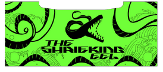

#### Electronics Cover

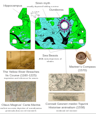

#### Sponsor Boards

There are two sponsor boards on the robot.

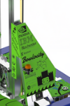

#### Eel Stickers

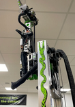

### Electronics

!!! failure "We don't have electronics documentation"

    If you see this, please talk to Luke. He says there was a sheet of paper in the shop with our electrical layout, but it has been lost.

    Any information at all on our electrical design would be appreciated. Please add it if you know something.

### Vision System

The Shrieking Eel has an impressive vision system this year. It features three [[Limelight#Limelight 4|Limelight 4's]] for reading [[Apriltag|apriltags]] on the field and doing pose-estimation, a time-of-flight depth camera for precise aiming when scoring coral, and a 360 camera for recording every angle of matches.

!!! todo "That other camera"

    There is another camera on the robot, but it isn't technically used for the vision system. should it be added here or not?

#### Limelights

!!! todo "TODO: Add more details"

There are three [[Limelight#Limelight 4|limelight 4's]] on the robot.

##### Coverage

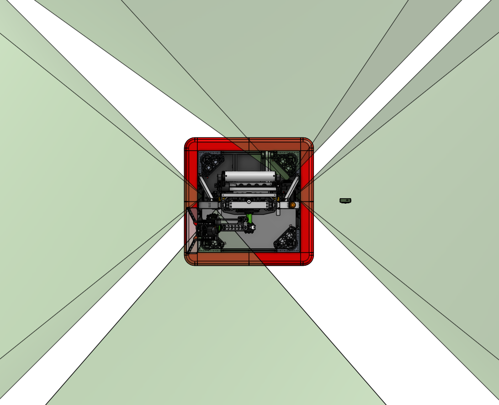

Note that the frustums shown in the image extend much further than the image suggests.

Link to cropping method: <https://github.com/Team2530/RobotCode2025/blob/1598b280134871187481bdb6dd90db7fc00f7f44/src/main/java/frc/robot/subsystems/Limelight.java#L71>

#### Depth Camera

This module is only responsible for automatically aiming the end effector towards the closest reefpost when attempting to place coral on the reef.

A Raspberry Pi 5 attached to an [Arducam Time of Flight camera](https://www.arducam.com/time-of-flight-camera-for-raspberry-pi.html) (SKU B0410) detected reefposts and published their locations in polar coordinates relative to the camera over network tables. 

The camera was selected for a few reasons:  

1. low cost ($50)
2. accuracy (down to 2cm)
3. high tolerance to varying light conditions (operating on a narrow IR band that is rarely found in nature or indoors)
4. ability to capture sharp details (unlike depth cameras that work by measuring stereo disparity or finding patterns in projected dot patterns)\
5. high enough frame rate (30fps)

Any local minimum along the horizontal plane (running parallel with the floor) and intersecting the optical axis is considered a reefpost. The distance measured at each local minimum is denoised by blurring the depth map. 

L2 algae can sit on this plane too, interfering with reefpost detection by sitting very close to the robot when it places coral on algae. The robot ignores measurements from this sensor if algae is detected (if a "detected reefpost" is suspiciously close to the robot). 

This simple algorithm is fast enough to operate on a single-thread process on the Raspberry Pi without comprimising frame rate. 

A live stream of the depth image from the camera can be served from the Pi to the drive station. The feed is augmented with local minima of each row of the depth image (white lines) and the positions of reef posts that are published to the network tables (green circles). Here's a screen recording of a live-stream of one of our practice matches.

<video controls>
    <source src="../assets/videos/output.mp4" type="video/mp4">
</video controls>

The time of flight camera was featured in a facebook post by FIRST Updates Now:

<iframe src="https://www.facebook.com/plugins/video.php?height=476&href=https%3A%2F%2Fwww.facebook.com%2Freel%2F664317249562039%2F&show_text=false&width=267&t=0" width="267" height="476" style="border:none;overflow:hidden" scrolling="no" frameborder="0" allowfullscreen="true" allow="autoplay; clipboard-write; encrypted-media; picture-in-picture; web-share" allowFullScreen="true"></iframe>

#### 360 Camera

This is the first year that our team has built a robot with a 360 camera on it. The Shrieking Eel has a [[Insta360]] mounted at the base of the arm.

<iframe width="560" height="315" src="https://www.youtube.com/embed/LslbrXiZlJY?si=-a2ZvpYGSXh3skN4" title="YouTube video player" frameborder="0" allow="accelerometer; autoplay; clipboard-write; encrypted-media; gyroscope; picture-in-picture; web-share" referrerpolicy="strict-origin-when-cross-origin" allowfullscreen></iframe>

!!! todo "More videos will be added soon"

    We recorded a lot of matches with the Insta360 and they will be here soon.

## Links

- [Onshape CAD Model](https://cad.onshape.com/documents/fa9a0365dfdf7e376f93f1b4/w/36bfb0cc9de95ef5933791e3/e/700ba3cf920578fe61d3ec24)
- [2025 Technical Manual](https://docs.google.com/presentation/d/1bto5VCYEVELLXvQ6iPSqBrLyz7rDSPktWtszlaASRLY/edit?usp=sharing)
