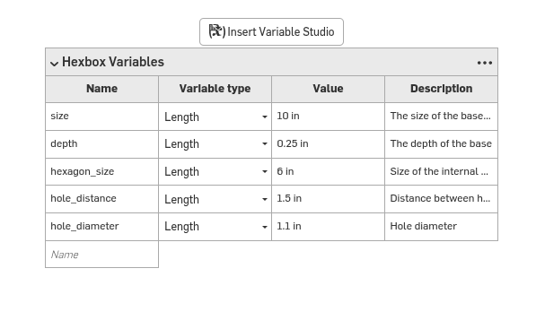
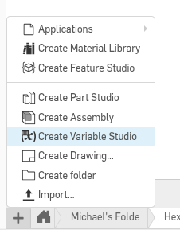

# Variable Studio

A variable studio is a special type of tab in [[Onshape]] that allows for the creation of variables. These variables are very useful and enable the creation of [[Part Studio|part studios]] and [[Assembly|assemblies]] that can be quickly changed to fit new parameters.

## Creating a Variable Studio

To create a variable studio, click on the Plus icon and then select "Variable Studio".

